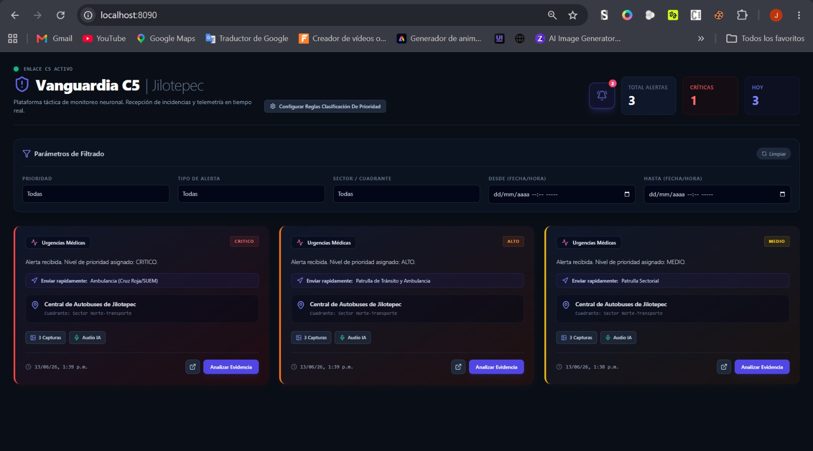

# C5 Alert System 22



## Descripción

**C5 Alert System 22** es una plataforma distribuida para la recepción, procesamiento, priorización, geolocalización y notificación de alertas de emergencia. El sistema integra dispositivos IoT (xiao esp32s3 sense), microservicios en Python, mensajería MQTT y un dashboard web para la visualización y monitoreo de incidentes en tiempo real.

Su objetivo es automatizar el flujo de atención de alertas, permitiendo que los eventos sean recibidos, enriquecidos con información geográfica, clasificados por prioridad y almacenados para su seguimiento histórico.

---

## Tecnologías y Herramientas

El sistema está construido utilizando una arquitectura de microservicios, comunicación en tiempo real mediante MQTT, procesamiento distribuido y una interfaz web para monitoreo de alertas.

<table>
<tr>
<td align="center">
<br>
<b>Python</b>
</td>

<td align="center">
<br>
<b>FastAPI</b>
</td>

<td align="center">
<br>
<b>gRPC</b>
</td>

<td align="center">
<br>
<b>C++</b>
</td>
</tr>

<tr>
<td align="center">
<br>
<b>PostgreSQL</b>
</td>

<td align="center">
<br>
<b>Redis</b>
</td>

<td align="center">
<br>
<b>MQTT</b>
</td>

<td align="center">
<br>
<b>Docker</b>
</td>
</tr>

<tr>
<td align="center">
<br>
<b>Docker Compose</b>
</td>

<td align="center">
<br>
<b>React</b>
</td>

<td align="center">
<br>
<b>Vite</b>
</td>

<td align="center">
<br>
<b>Tailwind CSS</b>
</td>
</tr>

<tr>
<td align="center">
<br>
<b>Nginx</b>
</td>

<td align="center">
<br>
<b>Seeed Studio XIAO ESP32S3 Sense</b>
</td>
</tr>
</table>

## Backend

Las APIs y microservicios del sistema fueron desarrollados utilizando:

* Python
* FastAPI
* gRPC
* Redis
* PostgreSQL
* MQTT (Mosquitto)

## Frontend

La interfaz web para monitoreo y gestión de alertas fue desarrollada con:

* React
* Vite
* Tailwind CSS

## Infraestructura y Despliegue

La contenerización y orquestación de servicios se realiza mediante:

* Docker
* Docker Compose
* Nginx

## Comunicación y Mensajería

Para la transmisión de alertas en tiempo real entre dispositivos y servicios:

* MQTT
* gRPC

## Hardware e IoT

Los dispositivos de generación de alertas utilizan:

* Seeed Studio XIAO ESP32S3 Sense
* Programación en C++ (Arduino Framework)

## Base de Datos y Caché

Para almacenamiento y optimización del rendimiento:

* PostgreSQL
* Redis

---

## Lógica y Flujo del Sistema

### Entradas (Inputs)

El sistema recibe información desde:

* Dispositivos ESP32 configurados como botones o sensores de alerta.
* Mensajes MQTT enviados por dispositivos conectados.
* Solicitudes desde el dashboard web.
* Datos de ubicación asociados a los eventos.

### Proceso

1. El dispositivo ESP32 genera una alerta.
2. La alerta es enviada mediante MQTT.
3. El servicio de recepción recibe el evento.
4. El servicio de geolocalización determina o complementa la ubicación.
5. El servicio de prioridad clasifica la severidad de la alerta.
6. El servicio de notificaciones genera avisos para los operadores.
7. El servicio histórico almacena la información para futuras consultas.
8. El dashboard muestra el estado actualizado de las alertas.

### Salidas (Outputs)

* Alertas clasificadas por prioridad.
* Notificaciones en tiempo real.
* Información geolocalizada.
* Historial de incidentes.
* Visualización mediante dashboard web.

---

## Prerrequisitos

Antes de ejecutar el proyecto, asegúrate de tener instalado:

* Docker 24+
* Docker Compose
* Node.js 18+
* npm 9+
* Python 3.10+
* Git

Opcional:

* Arduino IDE (para programar el xiao esp32s3 sense)
 ---

## Instalación y Despliegue

### 1. Clonar el repositorio

```bash
git clone <URL_DEL_REPOSITORIO>
cd c5_alert_system22
```

### 2. Construir los contenedores

```bash
docker-compose build
```

### 3. Levantar los servicios

```bash
docker-compose up -d
```

### 4. Verificar el estado

```bash
docker ps
```

### 5. Acceder al dashboard

```text
http://localhost
```

o

```text
http://localhost:8090/
```

---

## Uso

### Generar una alerta desde ESP32

1. Configurar el dispositivo.
2. Conectarlo a la red.
3. Activar el botón o sensor.
4. Verificar la recepción desde el dashboard.

### Monitorear alertas

* Abrir el dashboard web.
* Revisar las alertas activas.
* Consultar evidencia asociada.
* Aplicar reglas de atención.

---

## Estructura del Proyecto

```text
c5_alert_system22/
|   docker-compose.yaml
|   estructura.txt
|   mosquitto.conf
|   
+---dashboard-alertas
|   |   .gitignore
|   |   Dockerfile
|   |   eslint.config.js
|   |   index.html
|   |   package.json
|   |   postcss.config.js
|   |   README.md
|   |   tailwind.config.js
|   |   vite.config.js
|   |   
|   +---node_modules
|   +---public
|   |       favicon.svg
|   |       icons.svg
|   |       
|   \---src
|       |   App.css
|       |   App.jsx
|       |   index.css
|       |   main.jsx
|       |   
|       +---assets
|       |       hero.png
|       |       react.svg
|       |       vite.svg
|       |       
|       +---components
|       |       AlertCard.jsx
|       |       EvidenceModal.jsx
|       |       RulesModal.jsx
|       |       
|       \---utils
|               helpers.jsx
|               
+---esp32
|   \---Alerta_C5
|           Alerta_C5.ino
|           
+---media_alerts
|   \---XIAO_SENSE_01_20260613_212400
|           XIAO_SENSE_01_audio.wav
|           XIAO_SENSE_01_foto_1.jpg
|           XIAO_SENSE_01_foto_2.jpg
|           XIAO_SENSE_01_foto_3.jpg
|           XIAO_SENSE_01_transcripcion.txt
|           
+---nginx
|       nginx.conf
|       
+---services
|   +---geolocation
|   |       dockerfile
|   |       geolocation.proto
|   |       geolocation_pb2.py
|   |       geolocation_pb2_grpc.py
|   |       main.py
|   |       requirements.txt
|   |       
|   +---history
|   |       dockerfile
|   |       main.py
|   |       requirements.txt
|   |       
|   +---notification
|   |       dockerfile
|   |       main.py
|   |       requirements.txt
|   |       
|   +---priority
|   |       dockerfile
|   |       priority.proto
|   |       priority_pb2.py
|   |       priority_pb2_grpc.py
|   |       requirements.txt
|   |       server.py
|   |       
|   \---reception
|           dockerfile
|           geolocation.proto
|           geolocation_pb2.py
|           geolocation_pb2_grpc.py
|           main.py
|           priority.proto
|           priority_pb2.py
|           priority_pb2_grpc.py
|           requirements.txt
|           
\---shared_rules
        reglas.json
        

```

---

## Arquitectura General

```text
xiao esp32s3 sense
  │
  ▼
MQTT (Mosquitto)
  │
  ▼
Reception Service
  │
  ├──► Geolocation Service
  │
  ├──► Priority Service
  │
  ├──► Notification Service
  │
  └──► History Service
            │
            ▼
      Dashboard React
```

---

##  Autores y Equipo de Ingeniería

Este proyecto fue desarrollado gracias a la colaboración de:

<table align="center">
  <tr>
    <td align="center">
      <a href="https://github.com/VaneHdz04">
        <br />
        <sub><b>Vanesa Hernandez</b></sub>
      </a>
    </td>
    <td align="center">
      <a href="https://github.com/Jesusnm21">
        <br />
        <sub><b>Jesus Navarrete</b></sub>
      </a>
    </td>
    <td align="center">
      <a href="https://github.com/ROSY1304">
        <br />
        <sub><b>Rosa Miranda</b></sub>
      </a>
    </td>
    <td align="center">
      <a href="https://github.com/Sonia2004">
        <br />
        <sub><b>Sonia Cuevas García</b></sub>
      </a>
    </td>
  </tr>
  <tr>
    <td align="center">
      <a href="https://github.com/FabiolaCastanedaMondragon">
        <br />
        <sub><b>Fabiola Castañeda</b></sub>
      </a>
    </td>
    <td align="center">
      <a href="https://github.com/CarlosMadrigal-hub">
        <br />
        <sub><b>Carlos Madrigal</b></sub>
      </a>
    </td>
    <td align="center">
      <a href="https://github.com/ShaniaKinnerethDiazMoya">
        <br />
        <sub><b>Shania Diaz</b></sub>
      </a>
    </td>
    <td align="center">
      <a href="https://github.com/JocelinReyes">
        <br />
        <sub><b>Jocelin Reyes</b></sub>
      </a>
    </td>
  </tr>
</table>

---

## Licencia

Este proyecto se distribuye bajo la licencia definida por los autores del sistema.
